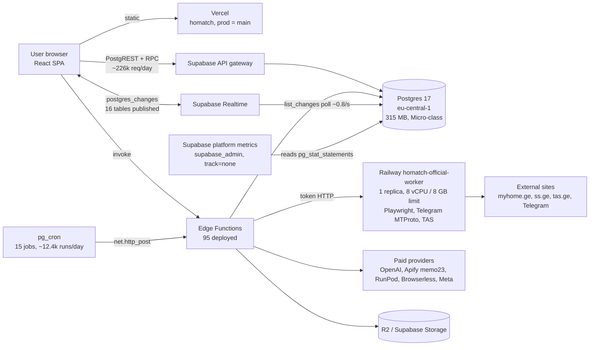

# HOMATCH production infrastructure, performance & scalability audit

Date: 2026-10-09 · Branch: `ccr-76ef455d-0qvt80` · Scope: infrastructure only.
Every production action in this audit was READ-ONLY. Nothing was deployed, applied,
paused, restarted, reset or reconfigured. Items marked **VERIFIED** were measured on
production or proven by a local reproduction; **INFERRED** items are reasoned from
evidence and say what would confirm them.

Reproduce the local evidence: `tests/sql/perf/run-db-bench.sh` (throwaway Postgres 16,
no network, no providers, no money).

---

## 0. Executive summary

1. **The database is not busy with users.** Production has **5 accounts, 1 active in
   the last 24 h** (VERIFIED). Every byte of current load is machine-generated: 15
   pg_cron jobs (~12.4k runs/day), the edge-function drivers they call (~35k
   invocations/day), ~226k API-gateway requests/day, Supabase Realtime's WAL
   polling, and Supabase's own platform monitoring.
2. **Disk writes are ~99% temporary files, not data.** Since the stats reset
   (2026-08-25, 44.5 days): 343.6 GB of temp files vs 1.3 GB of WAL and 3.4 GB of
   checkpoint writes; disk *reads* are negligible (32k blocks — the 315 MB database
   is fully cached). Measured rate today: **~13 GB/day temp** vs ~0.13 GB/day WAL.
3. **Root cause of the temp writes (VERIFIED mechanism, INFERRED caller):** every read
   of `pg_stat_statements` spills ~4.3–4.6 MB to disk, because the extension holds
   4,880 entries / 2.9 MB of query text (≈1,366 of them migration/DDL bodies,
   `track_utility=on`) and the result is built in a tuplestore larger than
   production's `work_mem` of 2,184 kB. Production temp files average 3.5 MB and the
   current files 4.3 MB; the local reproduction writes 4.60 MB per read at the same
   `work_mem`, **0 bytes at 8 MB `work_mem`, and 0 bytes after
   `pg_stat_statements_reset()`.** The periodic reader is untracked by design:
   `supabase_admin` ran `SET pg_stat_statements.track = none` 1,044 times — Supabase's
   own metrics collection. pg_stat_statements accounts for only ~0.9 GB of the 343 GB,
   which is exactly what an untracked reader predicts.
4. **The DB is currently throttled.** 48 cron runs failed with `job startup timeout`
   between 05:38 and 09:21 UTC today and none in the 25 h before; all jobs stalled
   together for up to 34 s. This matches the Disk IO Budget warning. (The audit's own
   pg_stat_statements reads and one 179 MB scan added load during 09:05–09:17; they
   were stopped.)
5. **Second write/space source:** `cron.job_run_details` keeps every run since
   2026-08-28 — 228k rows, **179 MB = 57% of the database**, never vacuumed, growing
   ~12.4k rows/day, each run written twice. A bounded retention job is prepared
   (§5, migration `20261024090000`), not applied.
6. **Capacity:** the platform has no measured user load to extrapolate from, so §4
   models it from per-request costs. The first saturation points at 10k DAU are not
   the database: they are the **Find Buyers discovery driver (~1 source job/minute
   by design)**, the **single Railway browser worker**, **postgres_changes Realtime**,
   and **paid-provider rate limits**. The database itself needs a compute step-up
   (Micro-class today) before launch traffic, and a pooled, read-scaled setup by 25–50k.

---

## 1. Architecture (verified inventory)



### 1.1 Services

| Component | Verified state | Notes |
|---|---|---|
| Vercel `homatch` | Production on `main`, static Vite SPA | No server functions in the hot path. |
| Supabase `ptxajsjhobhvsfhmutjn` | PG 17.6, eu-central-1, ACTIVE_HEALTHY | `max_connections=60`, `shared_buffers=280 MB`, `work_mem=2184 kB`, `effective_cache_size=480 MB` → Micro-class compute (INFERRED: the API does not expose the tier; confirm in Dashboard → Settings → Compute). |
| Edge functions | 95 deployed (cap 100) | Workers are driven by cron ticks, not a queue push. |
| Railway `homatch-official-worker` | 1 replica (ams), limits 8 vCPU / 8 GB; 7-day avg 0.002 vCPU, 0.30 GB; max 0.03 vCPU (hourly samples), 1.41 GB | The only worker (CLAUDE.md). Healthcheck `/health/browser`. |
| Railway `homatch-official-worker-v2` | Same repo/root, **no branch set**, only 6 variables (no provider or Supabase keys) | A dormant duplicate. Never use (CLAUDE.md); it is NOT a scaling replica. Removal is the owner's decision. |
| Railway `gpgcrm-telegram-worker` | Repo `insportia/gpgcrm-telegram-worker`, posts to `CRM_INGEST_URL` | A separate product (gpgcrm CRM), not HOMATCH. Out of scope; not touched. |
| Realtime | 2 logical slots (wal2json + pgoutput), 16 published tables, **4 live subscriptions** (notifications ×2, background_jobs ×2) | `list_changes`: 2.98 M calls, 6.3 B buffer hits = **85% of all DB buffer traffic**, 23,666 s of execution. CPU, not disk. |

### 1.2 Cron jobs (production, last ~28.6 h)

| Job | Schedule | Runs | Avg / p95 / max ms | Calls |
|---|---|---|---|---|
| homatch-jobs-worker | 30 s | 3,428 | 66 / 135 / 13,025 | jobs-worker (BATCH 10) |
| homatch-verify-driver | 30 s | 3,428 | 70 / 137 / 15,411 | research-agent backstop (DRIVE_BATCH 6) |
| homatch-discovery-driver | 1 min | 1,727 | 115 / 150 / 33,965 | discovery-queue-worker (1 source job/tick) |
| homatch-meta-ads-status-sync | 1 min | 1,727 | 92 / 82 / 33,687 | meta-ads-api |
| homatch-native-intent | 1 min | 1,727 | 75 / 76 / 15,216 | ingest-live-chat (BATCH 200) |
| homatch-ds-walkthrough-reconciler | 1 min | 1,727 | 92 / 78 / 34,261 | design-studio-reconstruct |
| classify-signals, revalidate-evidence | 5 min | 345 each | ~237 avg | |
| worker-quarter-hour, meta-ads-maintenance, telegram-sync, supply-matching | 15 min | 115 each | 321–476 avg | |
| forum-discovery, broker-directory-expiry, property-freshness | hourly | 28–29 | ≤ 376 avg | |

Cron itself only enqueues (`net.http_post` → pg_net); the p95 of ~80–150 ms is
healthy. The 10–34 s maxima are the DB-wide stalls in §0.4, not slow jobs.
pg_net: queue 0, recent responses 2,325×200, 696×202, 23×500, 12 timeouts.

### 1.3 Sync vs async (verified from code)

| Service | User request path | Background path | Throughput governor |
|---|---|---|---|
| Verify | SPA → research-agent (the client's polling advances the job) | cron backstop every 30 s, 6 jobs/tick, 14 ticks × 3 s per job | Client polls + 12 backstop job-steps/min; OpenAI/Apify limits |
| Find Buyers / Tenants | SPA → match-campaign (409 guards, reserve) | discovery-queue-worker: **1 native source job per minute** (each ≤ ~150 s) plus a social pass | `driver.ts:62` — deliberate, to keep leases valid |
| Find Property (Marketplace) | marketplace-search (OFF) | marketplace-worker-ingest + `claim_marketplace_worker_runs` (bounded leases) | Worker registry `max_concurrency`, global 40 |
| Documents / jobs | SPA → edge → `background_jobs` | jobs-worker: 10 per kind per 30 s | BATCH = 10 |
| Design Studio | design-studio-reconstruct → RunPod | reconciler every minute, `next_check_at` 15 s | GPU availability, `PROVIDER_DEADLINE_MS` |
| Mortgage | Client-side calculation + small RPCs | — | Not a capacity concern |
| Browser acquisition (MyHome, SS.ge, TAS) | — | Railway worker; TAS API concurrency 3 | One replica, Chromium memory |

### 1.4 Frontend polling and Realtime (verified)

Polling is already gated to "while something runs": Dashboard 4 s (only with live
runs), Verify documents 4 s (only in flight), matching progress 8 s (plus Realtime),
Outside Search 5 s, campaign status (pauses in hidden tabs — the only hook that
does). Thirteen `postgres_changes` channels exist. `LiveChatPage` subscribes to
**all** rows of `live_chat_messages` / `live_chat_reactions` without a filter.

---

## 2. Disk IO: ranked findings

| # | Finding | Evidence | Share of writes | Status |
|---|---|---|---|---|
| 1 | pg_stat_statements reads spill a ~4.3–4.6 MB tuplestore at `work_mem=2184kB` | 343.6 GB temp / 98.6k files; pgss tracks only 0.9 GB; 1,044 `SET pg_stat_statements.track = none` by supabase_admin; local reproduction 4.60 MB → 0 | **~96–99%** of PG-attributable writes | Mechanism VERIFIED; the caller being platform monitoring is INFERRED (confirm with `log_temp_files`, §6) |
| 2 | `cron.job_run_details` unbounded: 179 MB, 57% of the DB, no retention | 228k rows since 2026-08-28; insert + update per run; a full scan of 179 MB per time-filtered read | A small share of writes; a large share of space and cache pressure | VERIFIED; fix prepared |
| 3 | Realtime `list_changes` polling decodes all 16 published tables for 4 subscribers | 2.98 M calls, 6.3 B buffer hits (85% of buffer traffic) | CPU/memory (not disk) | VERIFIED; not changed (product-owned) |
| 4 | PostgREST schema reload: 3,062× a type-introspection query (195 ms mean, 0.78 GB temp) plus `pg_timezone_names` (341 ms mean) | pgss | ~0.8 GB total | VERIFIED; triggered by DDL/NOTIFY reloads — migrations |
| 5 | Catalog scans: `pg_class` 8.9 M seq scans / 6.17 B tuples read | pg_stat_all_tables | CPU | VERIFIED; from Realtime/PostgREST introspection |

Not a problem (VERIFIED):
- WAL is 1.3 GB in 44 days.
- Cache hit ratio is about 100%.
- No deadlocks.
- Autovacuum keeps up: the hot tables were vacuumed within hours.
- Dead tuples are low.
- pg_net is drained.
- Connections: 29 of 60, 2 active.

**About the 301 unindexed-FK advisor findings: do not act now.** The largest application
table is 11 MB and most are under 1 MB; every hot path in pgss is an index scan or a
sub-millisecond seq scan. An FK index pays off when the referencing table is large
*and* the parent is deleted or updated, or the FK is joined on a hot path. Revisit per
table when it passes about 50k rows. No index is proposed in this PR because no query
plan justifies one.

**What this audit cannot see:** Supabase's IO budget accounting (baseline/burst
balance) is not exposed through SQL or the MCP API. The owner should open Dashboard →
Reports → Database → Disk IO to confirm that today's 05:38 UTC depletion lines up with
the timeline above.

---

## 3. Local performance evidence (`tests/sql/perf/run-db-bench.sh`)

Run on 2026-10-09: 4 cores, Postgres 16, production `work_mem`.

```
== 1. TEMP SPILL (pg_stat_statements read)
  entries=4961 text_mb=2.88
  full read (with text), production work_mem     work_mem=2184kB  temp_files=+1   temp_bytes=+4600874
  read without text: pg_stat_statements(false)   work_mem=2184kB  temp_files=+1   temp_bytes=+1718236
  full read (with text), work_mem 8MB            work_mem=8MB     temp_files=+0   temp_bytes=+0
  full read after pg_stat_statements_reset()     work_mem=2184kB  temp_files=+0   temp_bytes=+0
== 2. QUEUE CLAIM (claim_marketplace_worker_runs, claim→complete)
  clients=1   tps=363.5  latency_avg=2.751 ms    done=18170 twice=0 stranded=0 runs_per_s=1817
  clients=8   tps=358.4  latency_avg=22.322 ms   done=17945 twice=0 stranded=0 runs_per_s=1795
  clients=32  tps=299.2  latency_avg=106.952 ms  done=15320 twice=0 stranded=0 runs_per_s=1532
== 3. CRON PURGE (20261024090000_cron_history_retention.sql)
  scheduled_jobs=1 schedule=41 * * * *
  call 1 deleted=20000 in 243ms
  calls=12 deleted=208333 remaining=41667 older_than_7d=0 kept_7d=41667
DB BENCH: PASS
```

Reading:
- **Temp spill:** the production temp-file size is reproduced exactly, and both
  remedies (smaller pgss, or more `work_mem`) remove it.
- **Queue claims:** correct under contention, with no duplicate and no lost run.
  Throughput is flat from 1 to 32 workers because the claim takes one advisory
  lock (`discovery_marketplace_claim`) by design. At about 1,500–1,800 runs/s on this
  machine that is 100× above any modelled need. Under contention latency rises
  (107 ms at 32 workers), so keep worker counts modest rather than removing the lock.
- **Retention:** 20k rows per call in about 245 ms on a 250k-row, 42-day history. It
  deletes only rows older than 7 days, and the job is scheduled once even when the
  migration is applied twice.

Not done, deliberately:
- no traffic against production;
- no staging Supabase project (creating projects is forbidden by CLAUDE.md);
- no paid provider was called.

An end-to-end HTTP load test needs a staging project or a Supabase branch, with
mocked providers; that is an owner decision (§7).

---

## 4. Capacity model

### 4.1 Inputs (measured unless marked)

| Input | Value | Source |
|---|---|---|
| DB time per user API request | ~9–15 ms mean (PostgREST RPCs) | pgss means for authenticated/service RPCs |
| Fixed background load | ~6 tx/s, ~12.4k cron runs/day, ~35k edge invocations/day | pg_stat_database delta, cron history, logs |
| Requests per operation | **assumed 30** (page load ~8 + polling ~20 + actions) | Poll intervals in §1.4; Verify polls 3–4 s for 1–5 min |
| Daily-to-peak-hour factor | **assumed 20%** of daily ops in the busiest hour; 5% in the busiest 10 min | Assumption; replace with real analytics at launch |
| DB core capacity | 1 core ≈ 1,000 ms of DB time per second | Definition |

### 4.2 Request and DB-core estimate (10 operations per user per day)

| DAU | Ops/day | Requests/day | Peak-hour req/s | Peak-10-min req/s | DB cores at 10 ms/req (peak hour / 10 min) |
|---|---|---|---|---|---|
| 10,000 | 100k | 3.0 M | 167 | 250 | 1.7 / 2.5 |
| 25,000 | 250k | 7.5 M | 417 | 625 | 4.2 / 6.3 |
| 50,000 | 500k | 15 M | 833 | 1,250 | 8.3 / 12.5 |

Uncertainty is about ±2–3×: requests per op and peak factors are assumptions until real
traffic exists. Add the fixed background load (today about 0.2–0.4 core) and keep 40%
headroom.

### 4.3 Bursts of concurrent *operations*

| Concurrent active ops | What happens first | Evidence |
|---|---|---|
| 100 | **Find Buyers discovery** backlog: about 1 native source job/min, so 100 campaigns × several source jobs = hours of queue. Railway worker browser memory if they are browser-backed (1.4 GB peak seen; Chromium contexts ~150–300 MB each, so about 20–30 per 8 GB). | `driver.ts:62`, Railway metrics |
| 500 | + Micro-class DB CPU (2 shared cores) and 60 connections; postgres_changes Realtime (single-threaded RLS check per change per subscriber); OpenAI per-minute token limits for Verify synthesis | DB settings, Realtime docs |
| 1,000+ | + Edge Function concurrency/CPU per invocation; RunPod GPU queue for Design Studio (minutes per job); per-provider rate limits (Apify, Meta Graph) | Provider docs; `PROVIDER_DEADLINE_MS` |

What scales already:
- leases and claims (SKIP LOCKED, attempt caps, bounded leases);
- idempotency keys (Marketplace, renewals, campaigns);
- PAYG reserve → settle → release, so paid-provider spend tracks revenue;
- Realtime fallbacks to polling;
- polling that stops when nothing is running.

---

## 5. Changes in this PR (infrastructure only)

| Change | Expected benefit | Risk | Rollback | Tests |
|---|---|---|---|---|
| `supabase/migrations/20261024090000_cron_history_retention.sql`: `public.purge_cron_history(keep 7 d, batch 20k)` walks the runid key oldest-first, plus an hourly cron (`41 * * * *`). **Prepared, NOT applied.** | Stops the 179 MB / 12.4k-rows/day growth. Backlog cleared in about 7 h at about 20k rows/h, then about 520 rows/h. Each call ≈ 250 ms. | Deletes diagnostic history older than 7 days (not restorable). Space is reused, not returned to the OS. | `select cron.unschedule('homatch-cron-history-retention'); drop function public.purge_cron_history(interval, integer);` | `tests/sql/perf/run-db-bench.sh` §3 (applied twice, exact keep-set) |
| `tests/sql/perf/` (fixture + runner) | Repeatable local evidence for the temp-spill root cause, queue-claim correctness and contention, and retention | None; it never touches production | Delete the folder | Self-checking (`DB BENCH: PASS`) |
| `scripts/release/components.mjs`: registers `public.purge_cron_history` → TOOLING | Future housekeeping migrations plan as TOOLING instead of REPO_FULL (CLAUDE.md: place new code areas in the same PR) | Release engine change, so this PR itself validates REPO_FULL | Revert the line | `tests/matrix/releasePath.test.mjs` 25/25 |
| This report | — | — | — | — |

No application code, UI, translation, RLS, pricing, provider, scraping, matching or
Railway change.

## 6. Production actions awaiting approval (none performed)

In recommended order. Each one is independent and reversible unless stated.

| # | Action | Benefit (evidence) | Risk | Rollback / verification |
|---|---|---|---|---|
| A1 | Save a pgss snapshot, then `select pg_stat_statements_reset();` | Temp spill per pgss read goes from 4.6 MB to 0 (local §3); production temp ≈ 10–13 GB/day → ≈ 0 until pgss regrows (weeks). Fastest IO relief. | Loses accumulated query statistics (snapshot first). You asked never to reset stats without approval. | Nothing to roll back. Verify: `temp_bytes` delta over 1 h ≈ 0. |
| A2 | Apply migration `20261024090000` | §5 | §5 | §5 |
| A3 | Raise compute Micro → **Small** (or Medium before launch) | Higher RAM, `work_mem`, IO baseline and burst budget; removes the 2 MB tuplestore spill structurally (8 MB `work_mem` → 0 spill, local §3). | Brief restart; monthly cost (§8). | Downgrade from the dashboard. |
| A4 | Set `pg_stat_statements.track_utility = off` (Supabase config/support; verify it is settable on this tier) | Stops migration and DDL bodies (1,366 of 4,880 entries) from refilling pgss. | Lose stats on utility statements. | Set it back on. |
| A5 | `log_temp_files = 4MB` for 24 h (Supabase config) | Names the exact statement and role behind every spill and confirms the inferred caller. | Log volume (about 2.2k lines/day). | Set back to -1. |
| A6 | Trim the Realtime publication to tables with subscribers (product review) | Cuts `list_changes` decode work (85% of buffer traffic). | Breaks any screen relying on an unpublished table; needs the owning workstreams. | `alter publication … add table`. |

## 7. Scaling plan

**Before launch (any DAU):**
- A1–A3.
- Alerting (§9).
- A staging Supabase branch plus a mocked-provider HTTP load test (k6/autocannon) run against it, never against production.
- Add hidden-tab pausing to the remaining pollers (Dashboard, Verify documents, matching progress), owned by the product workstreams.

**10k DAU:**
- **DB:** Medium (or Large) compute; use Supavisor transaction pooling for all server-side and edge clients.
- **Find Buyers:** raise discovery throughput by running N independent source-job lanes per tick, each with its own lease and a per-provider cap, instead of one job per minute. The leases already prevent double claims; keep `≤150 s` per job.
- **Railway:** 2 replicas of `homatch-official-worker`. Work is lease-claimed, so two replicas are safe; Telegram MTProto must stay single-session, behind a leader flag.
- **Realtime:** replace unfiltered `postgres_changes` (LiveChat) with Broadcast or filtered channels.

**25k DAU:**
- **DB:** Large/XL plus a read replica for admin, analytics and reports.
- **Queues:** move hot polling drivers from cron ticks to queue-triggered dispatch (pgmq/Supabase Queues) with back-pressure: per-user and per-provider concurrency, and per-day cost caps that already exist as settings.
- **Workers:** autoscale Railway on queue depth, 2–6 replicas.
- **Design Studio:** size the GPU pool from measured job minutes.

**50k DAU:**
- **DB:** XL/2XL plus replicas.
- **Partitioning:** partition append-only event tables (matching_job_events, usage/telemetry) by month.
- **Cache:** a CDN for public listing pages.
- **Edge Function cap:** keep shared functions and logical workers (no function per source; 95 of 100 used today). Raise the cap or consolidate before adding services.

## 8. Monthly cost estimate (infrastructure only; list prices to re-check before purchase)

| Scale | Supabase (Pro $25 + compute) | Railway worker | Vercel | Infra total (excl. paid AI/scraping/GPU) |
|---|---|---|---|---|
| Today | Pro + Micro ≈ $35 | 1 × (~0.002 vCPU, 0.3 GB) ≈ $5–10 | Pro ≈ $20 | ≈ $60–70 |
| 10k DAU | Pro + Medium ≈ $85–135 + egress | 2 replicas, ~1 vCPU / 2 GB each ≈ $60–80 | ≈ $20–50 | ≈ $170–270 |
| 25k DAU | Pro + Large + 1 read replica ≈ $250–350 | 2–4 replicas ≈ $120–200 | ≈ $50–150 | ≈ $420–700 |
| 50k DAU | Pro + XL + 2 replicas ≈ $650–900 | 4–6 replicas ≈ $250–400 | ≈ $150–400 | ≈ $1,050–1,700 |

Paid AI, scraping and GPU spend is per operation and is passed through PAYG at a margin
(`docs/COGS_PRICE_BOOK.md`; for example a market web search costs about $0.04 all-in).
It scales with revenue, not with infrastructure.

## 9. Monitoring, alerting and rollback

Alert on each item below. All are read-only SQL or the dashboard; schedule them from the
existing admin health surfaces.

| Signal | Query / source | Alert when |
|---|---|---|
| Temp writes | `pg_stat_database.temp_bytes` delta per hour | > 200 MB/h |
| Cron stalls | `cron.job_run_details where runid > max-1000 and status <> 'succeeded'` | any `job startup timeout` in 15 min |
| Disk IO budget | Dashboard → Reports → Disk IO | < 30% remaining |
| Connections | `count(*) from pg_stat_activity` | > 45 of 60 |
| Queue depth and age | per queue: count and `min(created_at)` of QUEUED rows (discovery_query_queue, background_jobs, marketplace worker runs) | oldest > 15 min |
| pg_net failures | `net._http_response` with status ≥ 500 or timed out, over 1 h | > 5% |
| Railway worker | memory, restarts | > 70% of limit, any restart loop |
| Provider spend | existing COGS ledger per provider per day | over the daily cap setting |

Rollback for this PR: revert the merge (no runtime code). Rollback for each production
action is in §6.

## 10. Isolation statement

- Work happened on `ccr-76ef455d-0qvt80`, restarted from `main` (8d7f0f95). That branch
  held only already-merged history.
- No other branch, worktree or PR was touched.
- Files changed:
  - `supabase/migrations/20261024090000_cron_history_retention.sql`
  - `tests/sql/perf/*`
  - `scripts/release/components.mjs` (one ownership line)
  - `docs/infra/SCALABILITY_AUDIT.md`
  - `docs/claude/PROJECT_STATE.md` (a pointer only)
- Protected systems were not touched: Verify, Find Property/Buyers, Mortgage, Design
  Studio, Meta Ads, Voice/AI TALK, Communications, billing, RLS, Railway services, cron
  jobs, database settings, statistics.
