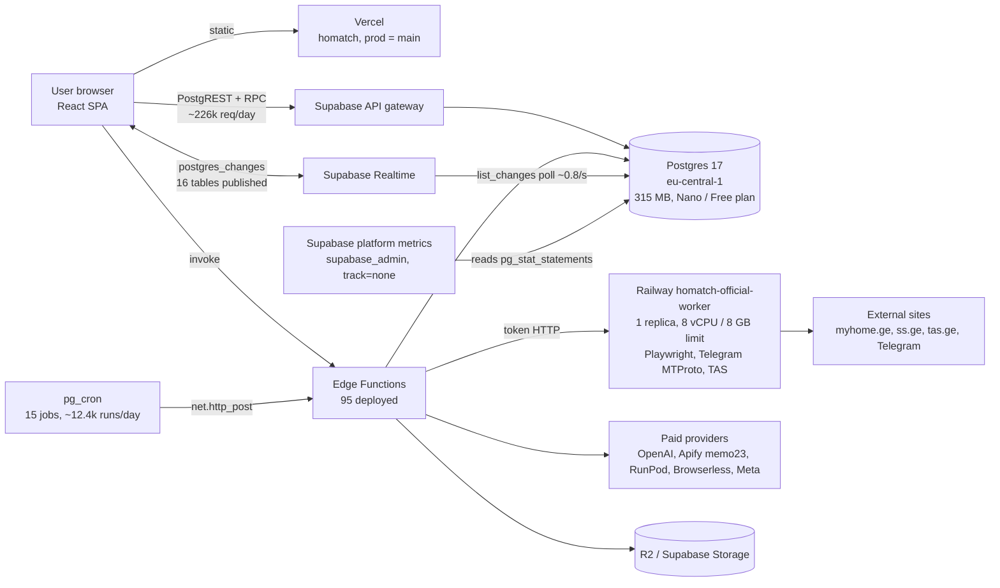

# HOMATCH production infrastructure, performance & scalability audit

Date: 2026-10-09 · Branch: `ccr-76ef455d-0qvt80` · Scope: infrastructure only.
Every production action in this audit was READ-ONLY. Nothing was deployed, applied,
paused, restarted, reset or reconfigured. Items marked **VERIFIED** were measured on
production or proven by a local reproduction; **INFERRED** items are reasoned from
evidence and say what would confirm them.

Reproduce the local evidence: `tests/sql/perf/run-db-bench.sh` (throwaway Postgres 16,
no network, no providers, no money).

---

## 0. Executive summary

1. **The database is not busy with users.** Production has **5 accounts, 1 active in
   the last 24 h** (VERIFIED). Every byte of current load is machine-generated: 15
   pg_cron jobs (~12.4k runs/day), the edge-function drivers they call (~35k
   invocations/day), ~226k API-gateway requests/day, Supabase Realtime's WAL
   polling, and Supabase's own platform monitoring.
2. **Disk writes are ~99% temporary files, not data.** Since the stats reset
   (2026-08-25, 44.5 days): 343.6 GB of temp files vs 1.3 GB of WAL and 3.4 GB of
   checkpoint writes; disk *reads* are negligible (32k blocks — the 315 MB database
   is fully cached). Measured rate today: **~13 GB/day temp** vs ~0.13 GB/day WAL.
3. **Root cause of the temp writes (VERIFIED mechanism, INFERRED caller):** every read
   of `pg_stat_statements` spills ~4.3–4.6 MB to disk, because the extension holds
   4,880 entries / 2.9 MB of query text (≈1,366 of them migration/DDL bodies,
   `track_utility=on`) and the result is built in a tuplestore larger than
   production's `work_mem` of 2,184 kB. Production temp files average 3.5 MB and the
   current files 4.3 MB; the local reproduction writes 4.60 MB per read at the same
   `work_mem`, **0 bytes at 8 MB `work_mem`, and 0 bytes after
   `pg_stat_statements_reset()`.** The periodic reader is untracked by design:
   `supabase_admin` ran `SET pg_stat_statements.track = none` 1,044 times — Supabase's
   own metrics collection. pg_stat_statements accounts for only ~0.9 GB of the 343 GB,
   which is exactly what an untracked reader predicts.
4. **The DB is currently throttled.** 48 cron runs failed with `job startup timeout`
   between 05:38 and 09:21 UTC today and none in the 25 h before; all jobs stalled
   together for up to 34 s. This matches the Disk IO Budget warning. (The audit's own
   pg_stat_statements reads and one 179 MB scan added load during 09:05–09:17; they
   were stopped.)
5. **Second write/space source:** `cron.job_run_details` keeps every run since
   2026-08-28 — 228k rows, **179 MB = 57% of the database**, never vacuumed, growing
   ~12.4k rows/day, each run written twice. A bounded retention job is prepared
   (§5, migration `20261025090000`), not applied.
6. **Capacity:** the platform has no measured user load to extrapolate from, so §4
   models it from per-request costs. The first saturation points at 10k DAU are not
   the database: they are the **Find Buyers discovery driver (~1 source job/minute
   by design)**, the **single Railway browser worker**, **postgres_changes Realtime**,
   and **paid-provider rate limits**. The database itself needs a compute step-up
   (**Nano on the Free plan today** — corrected in §11) before launch traffic, and a pooled, read-scaled setup by 25–50k.

---

## 1. Architecture (verified inventory)



### 1.1 Services

| Component | Verified state | Notes |
|---|---|---|
| Vercel `homatch` | Production on `main`, static Vite SPA | No server functions in the hot path. |
| Supabase `ptxajsjhobhvsfhmutjn` | PG 17.6, eu-central-1, ACTIVE_HEALTHY | `max_connections=60`, `shared_buffers=280 MB`, `work_mem=2184 kB`, `effective_cache_size=480 MB` → **Nano compute on the Free plan** (VERIFIED: organization plan `free`; Nano is the only Free-plan compute). The earlier "Micro-class" inference was wrong; see §11. |
| Edge functions | 95 deployed (cap 100) | Workers are driven by cron ticks, not a queue push. |
| Railway `homatch-official-worker` | 1 replica (ams), limits 8 vCPU / 8 GB; 7-day avg 0.002 vCPU, 0.30 GB; max 0.03 vCPU (hourly samples), 1.41 GB | The only worker (CLAUDE.md). Healthcheck `/health/browser`. |
| Railway `homatch-official-worker-v2` | Same repo/root, **no branch set**, only 6 variables (no provider or Supabase keys) | A dormant duplicate. Never use (CLAUDE.md); it is NOT a scaling replica. Removal is the owner's decision. |
| Railway `gpgcrm-telegram-worker` | Repo `insportia/gpgcrm-telegram-worker`, posts to `CRM_INGEST_URL` | A separate product (gpgcrm CRM), not HOMATCH. Out of scope; not touched. |
| Realtime | 2 logical slots (wal2json + pgoutput), 16 published tables, **4 live subscriptions** (notifications ×2, background_jobs ×2) | `list_changes`: 2.98 M calls, 6.3 B buffer hits = **85% of all DB buffer traffic**, 23,666 s of execution. CPU, not disk. |

### 1.2 Cron jobs (production, last ~28.6 h)

| Job | Schedule | Runs | Avg / p95 / max ms | Calls |
|---|---|---|---|---|
| homatch-jobs-worker | 30 s | 3,428 | 66 / 135 / 13,025 | jobs-worker (BATCH 10) |
| homatch-verify-driver | 30 s | 3,428 | 70 / 137 / 15,411 | research-agent backstop (DRIVE_BATCH 6) |
| homatch-discovery-driver | 1 min | 1,727 | 115 / 150 / 33,965 | discovery-queue-worker (1 source job/tick) |
| homatch-meta-ads-status-sync | 1 min | 1,727 | 92 / 82 / 33,687 | meta-ads-api |
| homatch-native-intent | 1 min | 1,727 | 75 / 76 / 15,216 | ingest-live-chat (BATCH 200) |
| homatch-ds-walkthrough-reconciler | 1 min | 1,727 | 92 / 78 / 34,261 | design-studio-reconstruct |
| classify-signals, revalidate-evidence | 5 min | 345 each | ~237 avg | |
| worker-quarter-hour, meta-ads-maintenance, telegram-sync, supply-matching | 15 min | 115 each | 321–476 avg | |
| forum-discovery, broker-directory-expiry, property-freshness | hourly | 28–29 | ≤ 376 avg | |

Cron itself only enqueues (`net.http_post` → pg_net); the p95 of ~80–150 ms is
healthy. The 10–34 s maxima are the DB-wide stalls in §0.4, not slow jobs.
pg_net: queue 0, recent responses 2,325×200, 696×202, 23×500, 12 timeouts.

### 1.3 Sync vs async (verified from code)

| Service | User request path | Background path | Throughput governor |
|---|---|---|---|
| Verify | SPA → research-agent (the client's polling advances the job) | cron backstop every 30 s, 6 jobs/tick, 14 ticks × 3 s per job | Client polls + 12 backstop job-steps/min; OpenAI/Apify limits |
| Find Buyers / Tenants | SPA → match-campaign (409 guards, reserve) | discovery-queue-worker: **1 native source job per minute** (each ≤ ~150 s) plus a social pass | `driver.ts:62` — deliberate, to keep leases valid |
| Find Property (Marketplace) | marketplace-search (OFF) | marketplace-worker-ingest + `claim_marketplace_worker_runs` (bounded leases) | Worker registry `max_concurrency`, global 40 |
| Documents / jobs | SPA → edge → `background_jobs` | jobs-worker: 10 per kind per 30 s | BATCH = 10 |
| Design Studio | design-studio-reconstruct → RunPod | reconciler every minute, `next_check_at` 15 s | GPU availability, `PROVIDER_DEADLINE_MS` |
| Mortgage | Client-side calculation + small RPCs | — | Not a capacity concern |
| Browser acquisition (MyHome, SS.ge, TAS) | — | Railway worker; TAS API concurrency 3 | One replica, Chromium memory |

### 1.4 Frontend polling and Realtime (verified)

Polling is already gated to "while something runs": Dashboard 4 s (only with live
runs), Verify documents 4 s (only in flight), matching progress 8 s (plus Realtime),
Outside Search 5 s, campaign status (pauses in hidden tabs — the only hook that
does). Thirteen `postgres_changes` channels exist. `LiveChatPage` subscribes to
**all** rows of `live_chat_messages` / `live_chat_reactions` without a filter.

---

## 2. Disk IO: ranked findings

| # | Finding | Evidence | Share of writes | Status |
|---|---|---|---|---|
| 1 | pg_stat_statements reads spill a ~4.3–4.6 MB tuplestore at `work_mem=2184kB` | 343.6 GB temp / 98.6k files; pgss tracks only 0.9 GB; 1,044 `SET pg_stat_statements.track = none` by supabase_admin; local reproduction 4.60 MB → 0 | **~96–99%** of PG-attributable writes | Mechanism VERIFIED; the caller being platform monitoring is INFERRED (confirm with `log_temp_files`, §6) |
| 2 | `cron.job_run_details` unbounded: 179 MB, 57% of the DB, no retention | 228k rows since 2026-08-28; insert + update per run; a full scan of 179 MB per time-filtered read | A small share of writes; a large share of space and cache pressure | VERIFIED; fix prepared |
| 3 | Realtime `list_changes` polling decodes all 16 published tables for 4 subscribers | 2.98 M calls, 6.3 B buffer hits (85% of buffer traffic) | CPU/memory (not disk) | VERIFIED; not changed (product-owned) |
| 4 | PostgREST schema reload: 3,062× a type-introspection query (195 ms mean, 0.78 GB temp) plus `pg_timezone_names` (341 ms mean) | pgss | ~0.8 GB total | VERIFIED; triggered by DDL/NOTIFY reloads — migrations |
| 5 | Catalog scans: `pg_class` 8.9 M seq scans / 6.17 B tuples read | pg_stat_all_tables | CPU | VERIFIED; from Realtime/PostgREST introspection |

Not a problem (VERIFIED):
- WAL is 1.3 GB in 44 days.
- Cache hit ratio is about 100%.
- No deadlocks.
- Autovacuum keeps up: the hot tables were vacuumed within hours.
- Dead tuples are low.
- pg_net is drained.
- Connections: 29 of 60, 2 active.

**About the 301 unindexed-FK advisor findings: do not act now.** The largest application
table is 11 MB and most are under 1 MB; every hot path in pgss is an index scan or a
sub-millisecond seq scan. An FK index pays off when the referencing table is large
*and* the parent is deleted or updated, or the FK is joined on a hot path. Revisit per
table when it passes about 50k rows. No index is proposed in this PR because no query
plan justifies one.

**What this audit cannot see:** Supabase's IO budget accounting (baseline/burst
balance) is not exposed through SQL or the MCP API. The owner should open Dashboard →
Reports → Database → Disk IO to confirm that today's 05:38 UTC depletion lines up with
the timeline above.

---

## 3. Local performance evidence (`tests/sql/perf/run-db-bench.sh`)

Run on 2026-10-09: 4 cores, Postgres 16, production `work_mem`.

```
== 1. TEMP SPILL (pg_stat_statements read)
  entries=4961 text_mb=2.88
  full read (with text), production work_mem     work_mem=2184kB  temp_files=+1   temp_bytes=+4600874
  read without text: pg_stat_statements(false)   work_mem=2184kB  temp_files=+1   temp_bytes=+1718236
  full read (with text), work_mem 8MB            work_mem=8MB     temp_files=+0   temp_bytes=+0
  full read after pg_stat_statements_reset()     work_mem=2184kB  temp_files=+0   temp_bytes=+0
== 2. QUEUE CLAIM (claim_marketplace_worker_runs, claim→complete)
  clients=1   tps=363.5  latency_avg=2.751 ms    done=18170 twice=0 stranded=0 runs_per_s=1817
  clients=8   tps=358.4  latency_avg=22.322 ms   done=17945 twice=0 stranded=0 runs_per_s=1795
  clients=32  tps=299.2  latency_avg=106.952 ms  done=15320 twice=0 stranded=0 runs_per_s=1532
== 3. CRON PURGE (20261025090000_cron_history_retention.sql)
  scheduled_jobs=1 schedule=41 * * * *
  call 1 deleted=20000 in 243ms
  calls=12 deleted=208333 remaining=41667 older_than_7d=0 kept_7d=41667
DB BENCH: PASS
```

Reading:
- **Temp spill:** the production temp-file size is reproduced exactly, and both
  remedies (smaller pgss, or more `work_mem`) remove it.
- **Queue claims:** correct under contention, with no duplicate and no lost run.
  Throughput is flat from 1 to 32 workers because the claim takes one advisory
  lock (`discovery_marketplace_claim`) by design. At about 1,500–1,800 runs/s on this
  machine that is 100× above any modelled need. Under contention latency rises
  (107 ms at 32 workers), so keep worker counts modest rather than removing the lock.
- **Retention:** 20k rows per call in about 245 ms on a 250k-row, 42-day history. It
  deletes only rows older than 7 days, and the job is scheduled once even when the
  migration is applied twice.

Not done, deliberately:
- no traffic against production;
- no staging Supabase project (creating projects is forbidden by CLAUDE.md);
- no paid provider was called.

An end-to-end HTTP load test needs a staging project or a Supabase branch, with
mocked providers; that is an owner decision (§7).

---

## 4. Capacity model

### 4.1 Inputs (measured unless marked)

| Input | Value | Source |
|---|---|---|
| DB time per user API request | ~9–15 ms mean (PostgREST RPCs) | pgss means for authenticated/service RPCs |
| Fixed background load | ~6 tx/s, ~12.4k cron runs/day, ~35k edge invocations/day | pg_stat_database delta, cron history, logs |
| Requests per operation | **assumed 30** (page load ~8 + polling ~20 + actions) | Poll intervals in §1.4; Verify polls 3–4 s for 1–5 min |
| Daily-to-peak-hour factor | **assumed 20%** of daily ops in the busiest hour; 5% in the busiest 10 min | Assumption; replace with real analytics at launch |
| DB core capacity | 1 core ≈ 1,000 ms of DB time per second | Definition |

### 4.2 Request and DB-core estimate (10 operations per user per day)

| DAU | Ops/day | Requests/day | Peak-hour req/s | Peak-10-min req/s | DB cores at 10 ms/req (peak hour / 10 min) |
|---|---|---|---|---|---|
| 10,000 | 100k | 3.0 M | 167 | 250 | 1.7 / 2.5 |
| 25,000 | 250k | 7.5 M | 417 | 625 | 4.2 / 6.3 |
| 50,000 | 500k | 15 M | 833 | 1,250 | 8.3 / 12.5 |

Uncertainty is about ±2–3×: requests per op and peak factors are assumptions until real
traffic exists. Add the fixed background load (today about 0.2–0.4 core) and keep 40%
headroom.

### 4.3 Bursts of concurrent *operations*

| Concurrent active ops | What happens first | Evidence |
|---|---|---|
| 100 | **Find Buyers discovery** backlog: about 1 native source job/min, so 100 campaigns × several source jobs = hours of queue. Railway worker browser memory if they are browser-backed (1.4 GB peak seen; Chromium contexts ~150–300 MB each, so about 20–30 per 8 GB). | `driver.ts:62`, Railway metrics |
| 500 | + Nano DB CPU/RAM (shared, ≤0.5 GB) (2 shared cores) and 60 connections; postgres_changes Realtime (single-threaded RLS check per change per subscriber); OpenAI per-minute token limits for Verify synthesis | DB settings, Realtime docs |
| 1,000+ | + Edge Function concurrency/CPU per invocation; RunPod GPU queue for Design Studio (minutes per job); per-provider rate limits (Apify, Meta Graph) | Provider docs; `PROVIDER_DEADLINE_MS` |

What scales already:
- leases and claims (SKIP LOCKED, attempt caps, bounded leases);
- idempotency keys (Marketplace, renewals, campaigns);
- PAYG reserve → settle → release, so paid-provider spend tracks revenue;
- Realtime fallbacks to polling;
- polling that stops when nothing is running.

---

## 5. Changes in this PR (infrastructure only)

| Change | Expected benefit | Risk | Rollback | Tests |
|---|---|---|---|---|
| `supabase/migrations/20261025090000_cron_history_retention.sql`: `public.purge_cron_history(keep 7 d, batch 20k)` walks the runid key oldest-first, plus an hourly cron (`41 * * * *`). **Prepared, NOT applied.** | Stops the 179 MB / 12.4k-rows/day growth. Backlog cleared in about 7 h at about 20k rows/h, then about 520 rows/h. Each call ≈ 250 ms. | Deletes diagnostic history older than 7 days (not restorable). Space is reused, not returned to the OS. | `select cron.unschedule('homatch-cron-history-retention'); drop function public.purge_cron_history(interval, integer);` | `tests/sql/perf/run-db-bench.sh` §3 (applied twice, exact keep-set) |
| `tests/sql/perf/` (fixture + runner) | Repeatable local evidence for the temp-spill root cause, queue-claim correctness and contention, and retention | None; it never touches production | Delete the folder | Self-checking (`DB BENCH: PASS`) |
| `scripts/release/components.mjs`: registers `public.purge_cron_history` → TOOLING | Future housekeeping migrations plan as TOOLING instead of REPO_FULL (CLAUDE.md: place new code areas in the same PR) | Release engine change, so this PR itself validates REPO_FULL | Revert the line | `tests/matrix/releasePath.test.mjs` 25/25 |
| This report | — | — | — | — |

No application code, UI, translation, RLS, pricing, provider, scraping, matching or
Railway change.

## 6. Production actions awaiting approval (none performed)

In recommended order. Each one is independent and reversible unless stated.

| # | Action | Benefit (evidence) | Risk | Rollback / verification |
|---|---|---|---|---|
| A1 | Save a pgss snapshot, then `select pg_stat_statements_reset();` | Temp spill per pgss read goes from 4.6 MB to 0 (local §3); production temp ≈ 10–13 GB/day → ≈ 0 until pgss regrows (weeks). Fastest IO relief. | Loses accumulated query statistics (snapshot first). You asked never to reset stats without approval. | Nothing to roll back. Verify: `temp_bytes` delta over 1 h ≈ 0. |
| A2 | Apply migration `20261025090000` | §5 | §5 | §5 |
| A3 | Upgrade Free → Pro and compute Nano → **Small** (see §11.2 for cost; Medium before launch) | Higher RAM, `work_mem`, IO baseline and burst budget; removes the 2 MB tuplestore spill structurally (8 MB `work_mem` → 0 spill, local §3). | Brief restart; monthly cost (§8). | Downgrade from the dashboard. |
| A4 | Set `pg_stat_statements.track_utility = off` (Supabase config/support; verify it is settable on this tier) | Stops migration and DDL bodies (1,366 of 4,880 entries) from refilling pgss. | Lose stats on utility statements. | Set it back on. |
| A5 | `log_temp_files = 4MB` for 24 h (Supabase config) | Names the exact statement and role behind every spill and confirms the inferred caller. | Log volume (about 2.2k lines/day). | Set back to -1. |
| A6 | Trim the Realtime publication to tables with subscribers (product review) | Cuts `list_changes` decode work (85% of buffer traffic). | Breaks any screen relying on an unpublished table; needs the owning workstreams. | `alter publication … add table`. |

## 7. Scaling plan

**Before launch (any DAU):**
- A1–A3.
- Alerting (§9).
- A staging Supabase branch plus a mocked-provider HTTP load test (k6/autocannon) run against it, never against production.
- Add hidden-tab pausing to the remaining pollers (Dashboard, Verify documents, matching progress), owned by the product workstreams.

**10k DAU:**
- **DB:** Medium (or Large) compute; use Supavisor transaction pooling for all server-side and edge clients.
- **Find Buyers:** raise discovery throughput by running N independent source-job lanes per tick, each with its own lease and a per-provider cap, instead of one job per minute. The leases already prevent double claims; keep `≤150 s` per job.
- **Railway:** 2 replicas of `homatch-official-worker`. Work is lease-claimed, so two replicas are safe; Telegram MTProto must stay single-session, behind a leader flag.
- **Realtime:** replace unfiltered `postgres_changes` (LiveChat) with Broadcast or filtered channels.

**25k DAU:**
- **DB:** Large/XL plus a read replica for admin, analytics and reports.
- **Queues:** move hot polling drivers from cron ticks to queue-triggered dispatch (pgmq/Supabase Queues) with back-pressure: per-user and per-provider concurrency, and per-day cost caps that already exist as settings.
- **Workers:** autoscale Railway on queue depth, 2–6 replicas.
- **Design Studio:** size the GPU pool from measured job minutes.

**50k DAU:**
- **DB:** XL/2XL plus replicas.
- **Partitioning:** partition append-only event tables (matching_job_events, usage/telemetry) by month.
- **Cache:** a CDN for public listing pages.
- **Edge Function cap:** keep shared functions and logical workers (no function per source; 95 of 100 used today). Raise the cap or consolidate before adding services.

## 8. Monthly cost estimate (infrastructure only; list prices to re-check before purchase)

| Scale | Supabase (Pro $25 + compute) | Railway worker | Vercel | Infra total (excl. paid AI/scraping/GPU) |
|---|---|---|---|---|
| Today | Free plan, Nano: $0 (Pro + Micro would be $25 net, §11) | 1 × (~0.002 vCPU, 0.3 GB) ≈ $5–10 | Pro ≈ $20 | ≈ $60–70 |
| 10k DAU | Pro + Medium ≈ $85–135 + egress | 2 replicas, ~1 vCPU / 2 GB each ≈ $60–80 | ≈ $20–50 | ≈ $170–270 |
| 25k DAU | Pro + Large + 1 read replica ≈ $250–350 | 2–4 replicas ≈ $120–200 | ≈ $50–150 | ≈ $420–700 |
| 50k DAU | Pro + XL + 2 replicas ≈ $650–900 | 4–6 replicas ≈ $250–400 | ≈ $150–400 | ≈ $1,050–1,700 |

Paid AI, scraping and GPU spend is per operation and is passed through PAYG at a margin
(`docs/COGS_PRICE_BOOK.md`; for example a market web search costs about $0.04 all-in).
It scales with revenue, not with infrastructure.

## 9. Monitoring, alerting and rollback

Alert on each item below. All are read-only SQL or the dashboard; schedule them from the
existing admin health surfaces.

| Signal | Query / source | Alert when |
|---|---|---|
| Temp writes | `pg_stat_database.temp_bytes` delta per hour | > 200 MB/h |
| Cron stalls | `cron.job_run_details where runid > max-1000 and status <> 'succeeded'` | any `job startup timeout` in 15 min |
| Disk IO budget | Dashboard → Reports → Disk IO | < 30% remaining |
| Connections | `count(*) from pg_stat_activity` | > 45 of 60 |
| Queue depth and age | per queue: count and `min(created_at)` of QUEUED rows (discovery_query_queue, background_jobs, marketplace worker runs) | oldest > 15 min |
| pg_net failures | `net._http_response` with status ≥ 500 or timed out, over 1 h | > 5% |
| Railway worker | memory, restarts | > 70% of limit, any restart loop |
| Provider spend | existing COGS ledger per provider per day | over the daily cap setting |

Rollback for this PR: revert the merge (no runtime code). Rollback for each production
action is in §6.

## 10. Isolation statement

- Work happened on `ccr-76ef455d-0qvt80`, restarted from `main` (8d7f0f95). That branch
  held only already-merged history.
- No other branch, worktree or PR was touched.
- Files changed:
  - `supabase/migrations/20261025090000_cron_history_retention.sql`
  - `tests/sql/perf/*`
  - `scripts/release/components.mjs` (one ownership line)
  - `docs/infra/SCALABILITY_AUDIT.md`
  - `docs/claude/PROJECT_STATE.md` (a pointer only)
- Protected systems were not touched: Verify, Find Property/Buyers, Mortgage, Design
  Studio, Meta Ads, Voice/AI TALK, Communications, billing, RLS, Railway services, cron
  jobs, database settings, statistics.

---

## 11. Pre-approval verification and recovery plan (follow-up, 2026-10-09 11:20 UTC)

### 11.1 What is proven and what is inferred

| Claim | Status | Evidence |
|---|---|---|
| DB writes are dominated by temp files | **PROVEN** | 344.6 GB temp vs 1.3 GB WAL and 3.4 GB checkpoint writes since 2026-08-25. Clean 2 h sample (09:16→11:16, no audit pgss reads): **+233 files, +952 MB ≈ 11.4 GB/day**, one ≈4.1 MB file every ≈31 s (`docs/infra/evidence/`). |
| Those temp files do not come from any statement pg_stat_statements tracks | **PROVEN** | pgss accounts for 0.98 GB of 344 GB. The only tracked spillers are PostgREST schema reloads and this audit's own reads. |
| Any full pg_stat_statements read at `work_mem=2184kB` spills ≈4.6 MB at today's ~4.9k entries / 2.9 MB of text | **PROVEN** | Local reproduction (§3). Every audit read in production wrote 582–585 blocks (4.8 MB). |
| A reset, or ≥8 MB `work_mem`, stops that spill | **PROVEN locally** | §3: 4.6 MB → 0 in both cases. |
| The repeated untracked reader is Supabase's metrics exporter | **INFERRED (strong)** | A persistent remote `supabase_admin` session `application_name=postgres_exporter` (since 2026-09-08); 1,044 × `SET pg_stat_statements.track = none` by `supabase_admin`; file size and cadence match a periodic scrape. Not yet seen: the statement itself. **A5 converts this to proven.** |
| These temp writes are what exhaust the Disk IO budget | **NOT PROVEN** | The budget is not readable from SQL or the API. Short-lived temp files can be absorbed by the OS page cache, and the *average* rate (≈0.13 MB/s) is low; budget is spent by bursts above baseline. Hence A1 is run as a **measured experiment with a stop rule**, not a promised fix. |
| The DB is currently throttled | **PROVEN (symptom)** | 48 pg_cron `job startup timeout` failures from 05:38 UTC, none in the prior 25 h; all jobs stalled together up to 34 s. |

### 11.2 Compute tier, Disk IO budget and cost (verified)

- **Plan: Free (organization `tier_free`), so compute is Nano**: shared CPU, ≤0.5 GB RAM, 500 MB database guidance. The earlier "Micro-class" reading of the settings was wrong.
- **Database size is a second clock.** 315 MB today, of which 179 MB is cron history growing ≈11 MB/day: about 17 days to 500 MB with no retention. That is the Free-plan size limit (the project risks read-only mode). **A2 also addresses this.**
- **Free-plan Edge Function limits explain two earlier symptoms** (Supabase docs):
  - The **100-function cap** caused the #72 402. Pro allows 500.
  - The **150 s wall clock** is the discovery driver's "≤150 s per job" bound. Paid plans allow 400 s.
- **Disk IO budget remaining: not readable here.** The owner reads Dashboard → Observability → "Disk IO % consumed" (Supabase: >1% means baseline was exceeded; 100% means the budget is exhausted).
- **Monthly cost:** the Pro plan is $25 and includes a $10 compute credit.

  | Option | Net per month |
  |---|---|
  | Pro + Micro (1 GB) | **≈ $25** |
  | Pro + Small (2 GB) | **≈ $30** |
  | Pro + Medium (4 GB) | **≈ $75** |

  Plus any disk over 8 GB (none today).
- **Downtime:** a compute change is "usually < 2 minutes" (Supabase docs). Changing the plan alone does not restart the database; Nano → Micro/Small does.

### 11.3 Ordered recovery plan

| Step | Action | Approval | Downtime | Risk | Rollback | Success criterion (measured, not assumed) |
|---|---|---|---|---|---|---|
| 0 | Baseline (read-only) | none | none | none | — | Record `temp_files/temp_bytes`, `wal_bytes`, cron failures/hour (queries in 11.6). The owner screenshots Disk IO % consumed, CPU and RAM. |
| 1 | **A2:** merge PR #136, then apply `20261025090000_cron_history_retention.sql` once via the guarded `apply_migration` | **YES** | none | Low (11.4) | `select cron.unschedule('homatch-cron-history-retention'); drop function public.purge_cron_history(interval, integer);` | Exactly one job is scheduled. The first run at :41 deletes ≤20,000 rows in < 5 s with 0 new cron failures. After about 7 h, rows older than 7 days = 0. `pg_database_size` stops growing from cron history. |
| 2 | **A5:** `log_temp_files = '4MB'` for 24 h | **YES** (and feasibility: superuser-only GUC, so it needs the Supabase config CLI or support; may need a paid plan) | none | Log volume (about 2.8k lines/day) | Set it back to `-1` | Log lines name the statement and user behind each temp file. If they show `postgres_exporter` reading `pg_stat_statements`, the caller is proven. Optional: A1 does not depend on it. |
| 3 | **A1.1:** keep evidence in the DB: `create schema if not exists infra_evidence; revoke all on schema infra_evidence from public, anon, authenticated; create table infra_evidence.pgss_20261009 as select now() as captured_at, * from pg_stat_statements;` | **YES** (DDL) | none | One 4.6 MB spill; about 3 MB of table | `drop schema infra_evidence cascade;` after review | The table row count equals the pgss entry count. Not readable by anon or authenticated. |
| 4 | **A1.2:** `select pg_stat_statements_reset();` | **YES** | none | 11.5 | None needed (statistics only) | Within 2 h the temp rate falls from ≈476 MB/h to **< 50 MB/h**. 0 cron `job startup timeout` in the following 24 h. Disk IO % consumed falls over the next day. **Stop rule:** if temp does not fall ≥80% in 2 h, the inferred caller is wrong; do not claim success, go to A5. |
| 5 | **A3:** Free → Pro, and compute Nano → **Small** (Micro is the minimum) | **YES** (spend) | **< 2 min** restart (connections drop; in-flight cron runs fail once and retry on the next tick; Realtime reconnects) | Cost; a brief outage. Run at a quiet minute, not :00/:15/:30/:45. | Downgrade the compute size (another short restart) | `show work_mem` rises. A pgss read writes 0 temp. Disk IO % consumed < 1%/day for 3 days. Edge Function cap 500. |

Do not do A4 (`track_utility` off) or A6 (Realtime publication) in this release. They need separate review, as you asked.

### 11.4 Retention migration: safety (proven by `tests/sql/perf/run-db-bench.sh` §3 and production read-only checks)

- **Deletes only history rows.** It touches `cron.job_run_details` only. `cron.job` is never written except to (re)schedule its own job by name, so no other schedule can change. The bench checks that `homatch-jobs-worker` survives.
- **Never deletes an active run.** Rows with status `starting`/`running` are excluded, and anything newer than 7 days is excluded. The bench checks that a 30-day-old `running` row survives.
- **No long locks.** DELETE takes row locks only, while pg_cron keeps inserting new rows. `lock_timeout 5s` means a call gives up rather than waits. No VACUUM FULL, no DDL on cron tables.
- **No duplicate jobs.** It unschedules by name, then schedules. Applying it twice leaves exactly one job (bench).
- **Bounded work.** At most 20,000 rows per call, walking the primary key; about 250–330 ms locally per call.
- **Production prerequisites (read 2026-10-09):**
  - pg_cron 1.6.4;
  - `postgres` can DELETE on `cron.job_run_details` and is not superuser;
  - the job and function do not exist yet;
  - 0 runs are in progress.
- **Independent of other migrations.** It defines one new function and one job, and reads no application table.

### 11.5 Consequences of resetting pg_stat_statements

- **What is lost:** per-query call counts, total and mean times, buffer and temp counters since 2026-08-28 (4,948 entries, 10.2 M calls). They feed the Dashboard's Query Performance page and the performance advisors. The cumulative `pg_stat_database`, `pg_stat_wal` and table counters are **not** reset.
- **Preserved before reset:**
  - `docs/infra/evidence/pgss-snapshot-2026-10-09.json`: per-role totals and the top statements by time, calls and temp, with no query text (utility statements can contain literals or secrets);
  - step A1.1: the full in-database copy.
- **Durability:** the fix decays as entries regrow (about 118/day observed; 1,366 of today's entries are migration and DDL bodies). Spills return after roughly 3 weeks unless A3 raises `work_mem` (or A4 stops utility entries). So **A1 is relief; A3 is the durable fix.**

### 11.6 Post-change monitoring (read-only; for 72 h after each step)

```sql
-- temp and WAL rate: run twice, 1 h apart, and diff
select now(), temp_files, temp_bytes, (select wal_bytes from pg_stat_wal) from pg_stat_database where datname = current_database();
-- cron health (uses the primary key, no full scan)
select status, left(return_message, 60), count(*) from cron.job_run_details
 where runid > (select max(runid) - 2000 from cron.job_run_details) and start_time > now() - interval '1 hour' group by 1, 2;
-- retention progress (one scan; run sparingly)
select count(*) filter (where start_time < now() - interval '7 days') old_rows, pg_size_pretty(pg_total_relation_size('cron.job_run_details')) from cron.job_run_details;
```

Alert or roll back on any of:
- temp > 200 MB/h after A1;
- any `job startup timeout`;
- a cron failure rate > 1%;
- the retention run taking > 10 s;
- Disk IO % consumed not falling within 24 h.

### 11.7 Compatibility with main and parallel PRs

- **Migration version.** It was renamed from `20261024090000` to `20261025090000`. PR #137 uses `20261024090000`…`130000`, so the old name collided. It now sorts after all of them. Future-dated names are the repository's convention, and the production ledger records the *apply-time* version (for example `20261003161647:marketplace_search_foundation`), so the filename date cannot reorder production. The gated `run_migrations` / `db push` path is not used; this migration is applied individually.
- **Merges.** The branch now contains main (`04e0cd94`, #135). It merges cleanly with main and with #137; the `components.mjs` line was moved off #137's edit point.
- **CI on #136 (run 248, before #135):**
  - Browser: `findPropertyMarketplace.test.mjs:122` timed out. #137 passes that suite on current main, so a rerun on the merged head is expected to pass.
  - Worker: `myhomeMarketplace.test.mjs` "MarketplaceSearchRequest drift" is **red on main itself since #135**. Reproduced locally on clean `origin/main` 04e0cd94 (28 pass, 1 fail). The fix (syncing `official-worker/src/marketplace/contract.ts`) belongs to the Find Property workstream and touches Railway worker code, so it is **not ported** into this infrastructure PR.

---

## 12. Recovery, data protection and gated execution plan (2026-10-09, 11:40 UTC)

Owner-supplied dashboard facts are treated as **VERIFIED**: Free plan, `t4g.nano`, CPU ≈ 90%, memory ≈ 74% of 0.5 GB, Disk IO ≈ 28%, disk 0.62 of 2 GB, data 333.5 MB, WAL 128 MB, no replicas.

### 12.1 Diagnosis (evidence class in brackets)

- **CPU ≈ 90% is not explained by SQL execution [VERIFIED negative].** pg_stat_statements records 11.64 h of execution over 42 days, about 1–2% of one core on average. Realtime's `list_changes` poll is the largest single item at 6.6 h total.
- **Ranked hypotheses for the CPU [UNVERIFIED]:**
  1. I/O wait while the disk is throttled. This fits the 05:38 onset and the cron startup timeouts. **Owner check:** Dashboard → CPU chart, the *iowait* component.
  2. Work pgss cannot see on a 0.5 GB box: the Realtime walsender doing logical decoding, `postgres_exporter`, pgbouncer, autovacuum.
  3. Memory pressure: `shared_buffers` is 280 MB of 512 MB, which leaves little OS page cache.
- **Temp writes, about 11.4 GB/day [VERIFIED]**, from untracked `pg_stat_statements` reads spilling at `work_mem` 2184 kB [mechanism VERIFIED + reproduced locally]. The reader is Supabase's `postgres_exporter` [STRONG HYPOTHESIS: not proven until `log_temp_files`].
- **cron history:** 179 MB, never purged [VERIFIED].
- **Free-plan limits already hit [VERIFIED]:**
  - 100 Edge Functions (the #72 402);
  - 150 s function wall clock;
  - no accessible backups.
- **Errors, last 24 h [VERIFIED]:**
  - API: 5xx 6 of 234k; 4xx 0.7%.
  - Functions: 5xx 85 of 36.6k, **all `supply-matching`**, the embed bug PR #137 fixes. Not infrastructure.
- **Load right now [VERIFIED 11:34 UTC]:**
  - 0 running Verify, matching, Design Studio or background jobs;
  - discovery queue drained (DONE/CANCELLED/FAILED only);
  - 29 connections of 60, 2 active;
  - 0 waiting locks, 0 queries over 10 s.

### 12.2 Data inventory and what protects it [VERIFIED counts, 11:34 UTC]

| Data | Lives in | Count / size | Covered by a Supabase DB backup? |
|---|---|---|---|
| Auth users, identities | Postgres `auth` | 5 auth / 12 profile rows | Yes (Pro daily backup). Custom-role passwords are not stored. |
| Properties, facts, matches | Postgres | 1 property, 74 matches | Yes |
| Verify jobs and reports | Postgres | 92 research_jobs (69 complete) | Yes |
| Find Buyers campaigns, assessments, cost ledger | Postgres | 4 / 412 / 221 | Yes |
| Design Studio projects, walkthroughs | Postgres metadata | 21 / 12 | Metadata yes |
| **Files (photos, documents, renders, 3D assets)** | **Cloudflare R2** (`homatch-storage`) via `public.storage_objects` (11,604 index rows) | — | **No.** R2 is outside Supabase and untouched by any step here. Separate protection (R2 versioning or a copy) would need its own approval. |
| Supabase Storage objects | Supabase Storage | 29 objects | **No** (Supabase docs: backups hold only metadata) |
| Wallets, ledger, reservations, payments | Postgres | 12 accounts, balance sum **99,804.72** = ledger sum 99,804.72 (114 rows); reservations 29 SETTLED / 1 RELEASED; 2 payments | Yes |
| Provider cost ledger | Postgres | 1,327 cost_events ($35.59) | Yes |
| Admin settings, cron jobs, migrations ledger | Postgres | 181 / 15 / 459 | Yes |
| Vault secrets | Postgres (encrypted) | 3 | In the backup, restorable into the *same* project |
| Edge Function secrets, Auth provider configuration | Supabase project configuration | — | **No** (not in the database) |
| Railway and Vercel environment variables, RunPod, Meta, OpenAI state | External | — | **No**; unaffected by any step here |

None of the proposed steps touches R2, project secrets, Railway or Vercel. The only step that deletes rows is A2, and it touches only `cron.job_run_details`.

### 12.3 Backups [VERIFIED from Supabase docs and plan]

- **Today (Free plan):** no daily backups available to restore. **There is no recovery path today except a logical dump you make yourself.**
- **Pro plan:**
  - daily physical backups, 7 days retained;
  - restore is **in place** from Dashboard → Database → Backups; the project is unavailable during the restore, for a time that grows with size (~0.6 GB disk, so expected minutes, not hours);
  - no new project is required.
- **PITR:** a Pro add-on, about $100/month for 7 days, needs ≥ Small. **Not recommended now**, because nothing justifies the cost yet.
- **Logical backup:** `supabase db dump` (roles, schema, data; three files) from a machine with the DB password. It reads the whole ~333 MB database once, which adds read IO to a throttled disk. Run it at a quiet time, or after the compute step. It cannot run from this sandbox (egress to the database is blocked).
- **Restore testing:** testing a restore safely means restoring into a *new* project, which CLAUDE.md forbids without your approval. **Not proposed.** Integrity is checked by restoring the dump into a local Postgres instead (no cloud resources).

### 12.4 Compute options [VERIFIED prices; IO limits to confirm on the Compute page]

| Option | RAM / CPU | Fixes | Does not fix | Monthly (Pro $25 incl. $10 compute credit) |
|---|---|---|---|---|
| Stay Free / Nano | 0.5 GB, shared | — | Everything; and no backups | $0 |
| Pro + Nano (billed as Micro) | same | **Backups**, 500 functions, 400 s | CPU and RAM pressure | **$25** |
| Pro + Micro | 1 GB, 2-core ARM shared | 2× RAM, higher IO baseline | Shared CPU; pgss spill may persist | **$25** ($10 compute fully credited) |
| **Pro + Small (recommended)** | 2 GB, 2-core ARM shared | 4× RAM (page cache for WAL, Realtime and temp), higher IO baseline; PITR-eligible | Still shared CPU; Supabase's `work_mem` for Small must be read after resize, so a pgss spill may persist without A1 | **$30** ($25 + $15 − $10) |
| Pro + Medium | 4 GB, shared | Headroom for real launch traffic | — | $75 |

Plus disk over 8 GB (none; 0.62 GB used) and any applicable VAT on the Supabase invoice (not visible here; check the billing page).

- **Every compute change:** a restart of under 2 minutes, reversible by resizing back (another restart).
- **Medium is justified** only when *measured* CPU or memory on Small stays above 70% during real user traffic.
- **10k–50k DAU (§4) is a model, not a measurement.** Claiming that capacity needs a staging load test with mocked providers (a separate approval).

### 12.5 Disk IO: temporary relief versus permanent fix

| Measure | Kind | Expected effect | Risk |
|---|---|---|---|
| A1 reset pgss (after the in-DB snapshot) | Temporary (about 3 weeks until entries regrow) | Temp writes ≈ 0 if the hypothesis holds (stop rule §11.3) | **MEDIUM**: irreversible loss of query-performance history (no customer data) |
| Compute ≥ Small | Permanent capacity | More cache; higher IO baseline; may or may not end the spill | **MEDIUM**: restart |
| A4 `track_utility = off` | Permanent; slows regrowth | Separate review | LOW–MEDIUM |
| A2 cron retention | Permanent | Stops 11 MB/day growth and frees cache | **MEDIUM**: irreversible delete of technical history; recoverable only from a backup |
| Selective `work_mem` | — | **Not recommended.** It is superuser-only, and the reader is a platform role. Raising it globally on 0.5 GB with 60 connections risks out-of-memory. | — |

### 12.6 Cron inventory (no job disabled; changes need the owners)

| Job | Schedule | Purpose (owner) | Runs/day | Typical / max | Idle most of the time? | Proposal |
|---|---|---|---|---|---|---|
| homatch-jobs-worker | 30 s | background_jobs (documents, tasks) — platform | 2,880 | 66 ms / 13 s | Yes (0 live now) | Fire only when a pending row exists (an `exists()` guard in the cron command) |
| homatch-verify-driver | 30 s | Verify backstop driver — Verify | 2,880 | 70 ms / 15 s | Yes (0 live) | Same guard on live research_jobs |
| homatch-discovery-driver | 1 min | Find Buyers / Find Property discovery — Discovery | 1,440 | 115 ms / 34 s | Yes (queue drained) | Guard on QUEUED rows |
| homatch-meta-ads-status-sync | 1 min | Meta Ads status — Meta Ads | 1,440 | 92 ms | When no live campaign | Guard on live campaigns |
| homatch-native-intent | 1 min | ingest-live-chat → native demand — Discovery | 1,440 | 75 ms | Depends on chat volume | Keep |
| homatch-ds-walkthrough-reconciler | 1 min | RunPod job reconciliation — Design Studio | 1,440 | 92 ms | Yes (0 RUNNING) | Guard on RUNNING walkthroughs |
| homatch-classify-signals | 5 min | classify-signals-v2 — Discovery | 288 | 238 ms | — | Keep |
| homatch-revalidate-evidence | 5 min | Verify evidence revalidation — Verify | 288 | 236 ms | — | Keep |
| homatch-worker-quarter-hour | 15 min | continuous-matching-worker — Matching | 96 | 441 ms | — | Keep |
| homatch-supply-matching | 15 min | supply-matching — Discovery (currently 5xx; #137 fixes) | 96 | 469 ms | — | Keep |
| homatch-telegram-sync | 15 min | community-sync (Telegram) — Discovery | 96 | 321 ms | — | Keep |
| homatch-meta-ads-maintenance | 15 min | Meta Ads maintenance — Meta Ads | 96 | 476 ms | — | Keep |
| homatch-forum-discovery | hourly :17 | demand-discovery (forums) — Discovery | 24 | 376 ms | — | Keep |
| homatch-broker-directory-expiry | hourly :07 | SQL sweep — Broker | 24 | 169 ms | — | Keep |
| homatch-property-freshness | hourly :23 | SQL sweep — Owner Workspace | 24 | 126 ms | — | Keep |

**Cost of each run:**
- a pg_cron history row, written twice;
- a pg_net request row plus a response row;
- one Edge Function invocation.

The six "guard" candidates are about 11,500 of the about 12,400 daily runs. A guarded command keeps the job and its schedule and only skips the HTTP call when there is no work, so with no work it costs one cheap indexed `exists()`.

**Risk: MEDIUM.** A wrong guard silently stalls a feature. Each guard needs its owning workstream's review and a regression check; none is in this PR.

Overlap risk is already handled: each driver claims with leases or SKIP LOCKED, and the measured max durations (≤ 34 s, the stall events) are below every interval except the 30 s jobs during stalls. Their claims are idempotent.

### 12.7 Realtime

- **Published:** 16 tables. **Live subscriptions now:** 4 (`notifications` ×2, `background_jobs` ×2).
- **Frontend dependents (code):**
  - notifications: NotificationsPage, useNotificationCount;
  - messages, conversations: ChatPage;
  - live_chat_messages, live_chat_reactions: LiveChatPage, unfiltered;
  - outreach_campaigns / outreach_sends: Email/SMS campaign pages;
  - comm inbox and calls;
  - meta_leads: LeadsCenter;
  - matching_job_events, external_discovery_events: MatchingJobProgress.
- **Proposal:** none in this release. Trimming the publication or moving progress to Broadcast is **HIGH risk** to live screens and needs each owner's sign-off.

### 12.8 Migration compatibility (#136 vs #137 vs #109)

- **#136's migration is now `20261025090000`;** #137 owns `20261024090000`…`130000`.
- **The collision was real for the tooling, not for the production ledger.** The MCP/`apply_migration` path records the apply-time version. But the Supabase CLI (`db push`, `migration list`) keys by filename version, so two files sharing `20261024090000` would have broken it.
- **#109 (Design Studio)** has no migration.
- **Merges:** #136 merges cleanly with main and with #137.
- **CI on #136's merged head (run 255):** plan, static, unit and **browser pass**. Only "Railway worker tests" fail: `myhomeMarketplace.test.mjs` "MarketplaceSearchRequest drift", **red on main since #135** (reproduced on clean `origin/main`). Owner: Find Property (official-worker contract copy). Not ported here.

### 12.9 Gated execution order

| Gate | Step | Risk | Downtime | Rollback | Verify |
|---|---|---|---|---|---|
| 1 | Read-only diagnosis (done) | — | — | — | — |
| 2 | **G2.1** Upgrade organization Free → Pro | LOW: no data change, no restart; billing commitment $25/month | none | Downgrade the plan (backups and 500-function limit lost again) | Plan shows Pro |
| 2 | **G2.2** Wait for the first daily backup to appear (Dashboard → Database → Backups) | LOW | none | — | A backup row with a timestamp |
| 2 | **G2.3** (optional) Logical `db dump` by the owner, at a quiet time | MEDIUM: one full read on a throttled disk | none | — | Restores into a local Postgres; row counts match 12.2 |
| 3 | **G3** Compute Nano → **Small** at a quiet minute (not :00/:15/:30/:45; nothing is in flight today) | MEDIUM: restart | **< 2 min**: API and functions error, cron runs in the window fail once, Realtime reconnects | Resize back (restart) | 12.10 checklist |
| 4 | **G4.1** Apply A2 cron retention | MEDIUM: irreversible delete of technical history, recoverable from G2.2's backup | none | Unschedule and drop the function | §11.3 criteria |
| 4 | **G4.2** A1.1 in-DB pgss snapshot, then A1.2 reset (separately approved) | MEDIUM: irreversible loss of statistics history | none | — | Temp rate < 50 MB/h within 2 h, else stop |
| 4 | **G4.3** (optional) A5 `log_temp_files` 24 h | LOW (feasibility unknown) | none | Set back | Proves or refutes the exporter hypothesis |
| 5 | Verification (12.10) after each gate | — | — | — | — |

Not in this plan, each needing separate review: cron guards (12.6), A4, Realtime changes, PITR, read replicas, Medium or larger.

**Incident response for G3:** if the project is not healthy 10 minutes after the resize (API 5xx > 1%, auth failing, cron failing), open a Supabase support ticket and resize back. No data is at risk from a compute change; the disk is untouched.

### 12.10 Post-change verification checklist (low impact, no paid providers)

- **Auth:** an existing user signs in, and `auth.users` = 5.
- **Data:** row counts from 12.2 are unchanged (properties 1, matches 74, research_jobs 92, ds_projects 21, find_buyers_campaigns 4, storage_objects 11,604).
- **Billing:** the credit_accounts balance sum still equals the credit_ledger sum (99,804.72 unless a legitimate transaction happened), and the reservation counts are explained.
- **Features:** Find Property loads, a Verify report opens, a Design Studio project opens, the Find Buyers campaign page loads. All read-only; no new paid run.
- **Health:**
  - API 5xx is not above baseline (6 in 24 h);
  - function 5xx only the known supply-matching ones;
  - cron `job startup timeout` = 0 for 24 h;
  - CPU < 70% and memory < 70% on the dashboard;
  - after G4.2, temp < 50 MB/h;
  - no queue backlog (no QUEUED rows older than 15 min).
